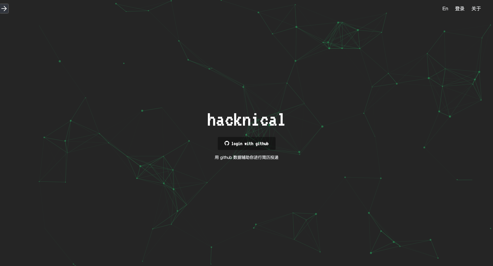
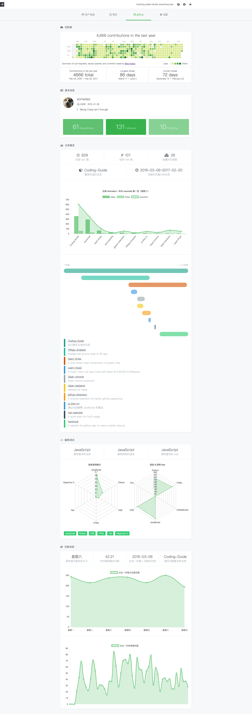

# [Hacknical](http://hacknical.com?locale=zh)

> hacknical 通过抓取用户的 github 数据，来形成一个可视化展示的 github 分析报告，以此辅助用户更好的完善自己的简历。
>
> [查看网站](http://hacknical.com?locale=zh)

[English Version of README](./README.md)

抽离依赖：

- UI 组件 --> [light-ui](https://github.com/ecmadao/light-ui)
- GitHub API 爬虫 --> [hacknical-api](https://github.com/ecmadao/hacknical-api)

## 截图

> 登录界面

> github 数据分析

## 关于

更加详细的 [项目说明](./doc/ABOUT-zh.md)。[English Version](./doc/ABOUT-en.md)

## Todos

- [x] 支持英语
- [ ] 支持抓取 github 上的组织
- [ ] 支持分析用户 fork 的项目
- [ ] 支持移动端简历编辑
- [ ] 支持移动端简历展示

## 技术栈

- backend

  - koa2
  - redis
  - mongoose
  - nunjucks
  - request
  - pm2

- frontend

  - react
  - redux
  - react-router
  - particles
  - scrollreveal
  - chart.js
  - clipboard
  - headroom.js
  - webpack

## License

[Apache License](./LICENSE)

## Author

[ecmadao](//github.com/ecmadao)