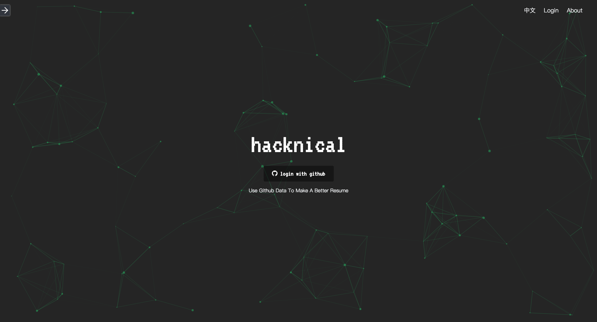
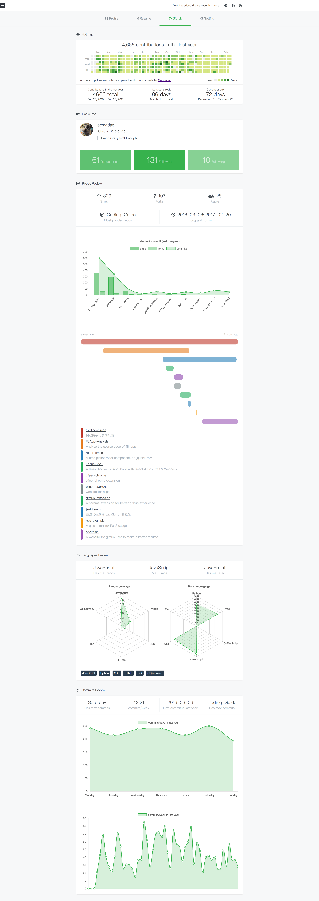

# [Hacknical](http://hacknical.com?locale=en)

> A website for github user to make a better resume,  and see his github contributions/commits/languages/repos datas analysis.
>
> [Click to see this website](http://hacknical.com?locale=en)

[中文版 README](./README-ZH.md)

**Attention：this repos only support Chinese version now, but will publish English version later.**

**Attention2：Most of the pages support English now😁😁😁, including github data analysis page. (Expect Resume Editor & Part of Mobile Pages) **

## Screenshots

> login page

> github datas analysis

## About

See [Project description](./doc/ABOUT-en.md) here. [中文版说明](./doc/ABOUT-zh.md)

## Todos

- [x] support English
- [ ] support orgs
- [ ] support forked repos
- [ ] support edit resume in mobile
- [ ] support show resume in mobile

## Techs

- backend

  - koa2
  - redis
  - mongoose
  - nunjucks
  - request
  - pm2

- frontend

  - react
  - redux
  - react-router
  - particles
  - scrollreveal
  - chart.js
  - clipboard
  - headroom.js
  - webpack

## License

[Apache License](./LICENSE)

## Author

[ecmadao](//github.com/ecmadao)
