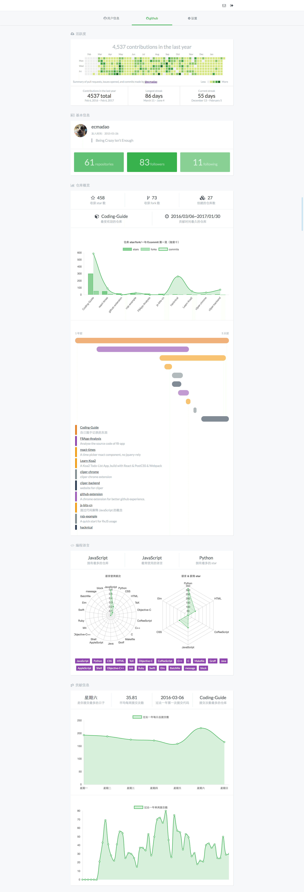

# [Hacknical](http://hacknical.com)

> A website for github user to make a better resume,  and see his github contributions/commits/languages/repos datas analysis.
>
> [Click to see this website](http://hacknical.com)

## Screenshots

> login page

> github datas analysis

## About

关于 hacknical 的[项目说明](./ABOUT.md)

## Techs

- backend

  - koa2
  - redis
  - mongoose
  - nunjucks
  - request
  - pm2
  - nginx
  - nodemon
  - ...

- frontend

  - react
  - redux
  - react-router
  - particles
  - scrollreveal
  - chart.js
  - clipboard
  - headroom.js
  - webpack
  - ...

- both

  - moment
  - es6
  - babel
  - fetch
  - ...

## License

[Apache License](./LICENSE)

## Author

[ecmadao](//github.com/ecmadao)
