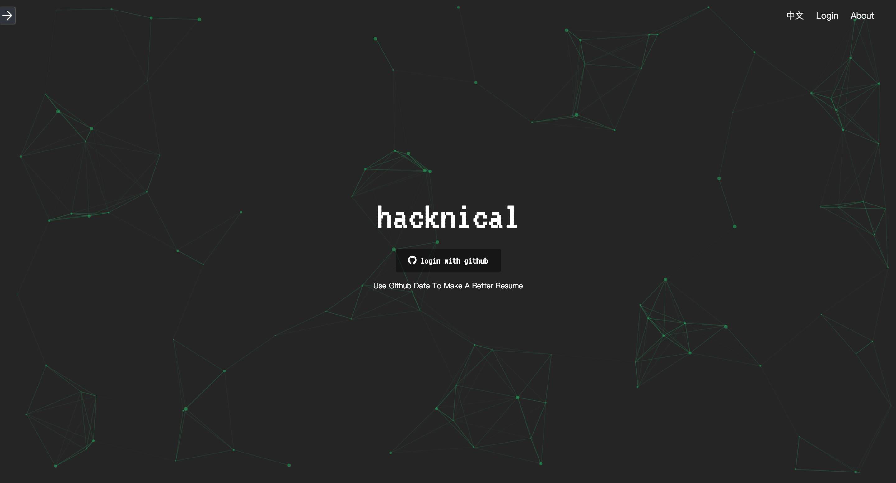

# [Hacknical](https://hacknical.com)

**hacknical, hacker & technical**


> A website for GitHub user to generate his GitHub data analysis (contributions/commits/languages/repos datas), helps to make a better resume.

[中文版 README](./doc/README-ZH.md)

**Attention：Most of the pages support English now😁😁😁, including github data analysis page.**

Extract dependency：

- UI Components --> [light-ui](https://github.com/ecmadao/light-ui)
- GitHub API crawler --> [hacknical-github](https://github.com/ecmadao/hacknical-github)

## Examples

- [My GitHub data analysis](https://hacknical.com/ecmadao/github)

## Screenshots

> login page



> github datas analysis


## About

[中文版说明](./doc/ABOUT-zh.md)

## Local SQLite

Node 22.13+ is required. The local profile uses Node's built-in SQLite driver, an in-process cache, a no-op message queue, and local file uploads, so Redis, MongoDB, and OSS are not required for local startup:

```bash
nvm use
npm install
npm run start-local
```

## Todos

- [x] support English
- [x] support orgs
- [ ] support forked repos
- [ ] support edit resume in mobile
- [x] support show resume in mobile
- [x] support export resume to PDF

## Techs

- backend

  - koa2
  - redis
  - mongoose
  - nunjucks
  - request
  - pm2

- frontend

  - react
  - redux
  - react-router
  - particles
  - scrollreveal
  - chart.js
  - clipboard
  - headroom.js
  - webpack


## License

[Apache License](./LICENSE)

## Author

[ecmadao](//github.com/ecmadao)
