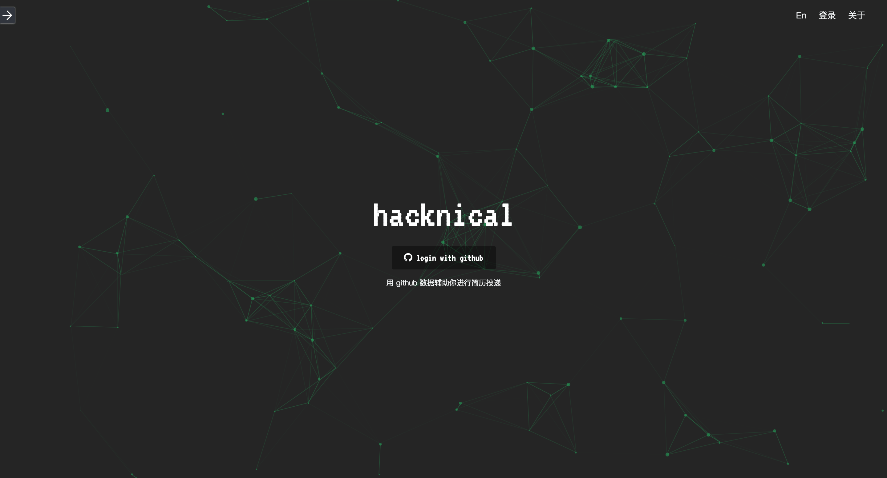

# [Hacknical](http://hacknical.com?locale=zh)


> hacknical 通过抓取用户的 github 数据，来形成一个可视化展示的 github 分析报告，以此辅助用户更好的完善自己的简历。

[English Version of README](../README.md)

抽离依赖：

- UI 组件 --> [light-ui](https://github.com/ecmadao/light-ui)
- GitHub API 爬虫 --> [hacknical-github](https://github.com/ecmadao/hacknical-github)

## 案例

- [我的 github 数据分析报告](http://hacknical.com/ecmadao/github)
- [我的在线简历](http://hacknical.com/ecmadao/resume)

## 截图

> 登录界面



> github 数据分析


## 关于

更加详细的 [项目说明](./doc/ABOUT-zh.md)

## 参与贡献

### 架构说明

hacknical 目前拆分成为了两个 server，以及一个 UI 组件库：

- [hacknical](https://github.com/ecmadao/hacknical) 主 server，除去前端渲染等作用外，链接用户管理、用户简历等数据库
- [hacknical-github](https://github.com/ecmadao/hacknical-github) 负责提供 GitHub 数据的 server，负责用户 GitHub 数据的抓取、存储
- [light-ui](https://github.com/ecmadao/light-ui) 一个 React UI 组件库

在储存方面，使用 redis 做缓存，并统一使用 MongoDB 作为数据库储存。

### 本地开发

```bash
$ git clone git@github.com:ecmadao/hacknical.git
$ git clone git@github.com:ecmadao/hacknical-github.git

$ cd hacknical
$ npm i
$ cd hacknical-github
$ npm i

# 安装 redis 以及 MongoDB
# 具体安装教程忽略，请自行搜索
```

在 [OAuth application](https://github.com/settings/applications/new) 注册一个新应用以便进行本地开发，配置如下：

```text
Application name: hacknical-local
Homepage URL: http://localhost:4000/
Authorization callback URL: http://localhost:4000/user/login/github
```

注册成功之后，将获取的 `Client ID` 、`Client Secret` 以及 `Application name` 填充至 `hacknical-github/config/localdev.json` 文件中：

```json
// hacknical-github/config/localdev.json
{
  "production": false,
  "port": "5002",
  "appKey": "hacknical-github-local",
  "appName": "hacknical-github-local",
  "app": {
    "hacknical-local": {
      "clientId": "将你的 Client ID 填充至此",
      "clientSecret": "将你的 Client Secret 填充至此",
      "appName": "hacknical-local",
      "token": ""
    }
  }
}
```

除此以外，还可以在 `hacknical/config/localdev.json` 以及 `hacknical-github/config/localdev.json` 中修改数据库链接、server 端口等配置。

### 提交说明

#### Bug 修复

Bug 相关的修复可以直接发起 pull request，当然也欢迎在 issue 中指出，我会尽快进行修复。

#### 新 feature

- 在相关项目下开启新 issue
- 同步最新 master 分支
- 发起 pull request

## Todos

- [x] 支持英语
- [x] 支持抓取 github 上的组织
- [ ] 支持分析用户 fork 的项目
- [ ] 支持移动端简历编辑
- [x] 支持移动端简历展示
- [x] 支持简历导出

## 技术栈

- backend

  - koa2
  - redis
  - mongoose
  - nunjucks
  - request
  - pm2

- frontend

  - react
  - redux
  - react-router
  - particles
  - scrollreveal
  - chart.js
  - clipboard
  - headroom.js
  - webpack

## License

[Apache License](./LICENSE)

## Author

[ecmadao](//github.com/ecmadao)
