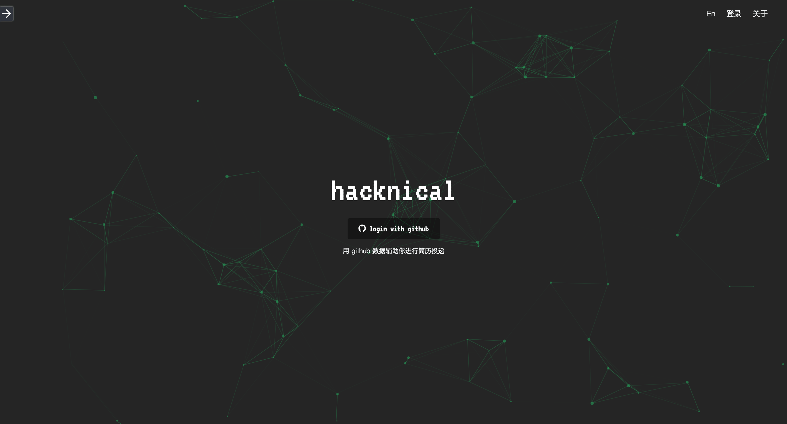

# [Hacknical](https://hackneo.cn?locale=zh)


> hacknical 通过抓取用户的 github 数据，来形成一个可视化展示的 github 分析报告，以此辅助用户更好的完善自己的简历。

[English Version of README](../README.md)

抽离依赖：

- UI 组件 --> [light-ui](https://github.com/ecmadao/light-ui)
- GitHub API 爬虫 --> [hacknical-github](https://github.com/ecmadao/hacknical-github)

## 案例

- [我的 github 数据分析报告](https://hackneo.cn/ecmadao/github)
- [我的在线简历](https://hackneo.cn/ecmadao/resume)

## 截图

> 登录界面



> github 数据分析


## 关于

更加详细的 [项目说明](./doc/ABOUT-zh.md)

## 参与贡献

### 架构说明

hacknical 目前拆分成为了两个 server，以及一个 UI 组件库：

- [hacknical](https://github.com/ecmadao/hacknical) 主 server，除去前端渲染等作用外，链接用户管理、用户简历等数据库
- [hacknical-github](https://github.com/ecmadao/hacknical-github) 负责提供 GitHub 数据的 server，负责用户 GitHub 数据的抓取、存储
- [light-ui](https://github.com/ecmadao/light-ui) 一个 React UI 组件库

在储存方面，使用 redis 做缓存，并统一使用 MongoDB 作为数据库储存。

### 本地开发

当前版本默认使用 Node 22.13+ 自带的 SQLite（`node:sqlite`），本地启动不需要 Redis、MongoDB 或阿里云 OSS。数据库文件和上传文件分别保存在 `data/hacknical.sqlite` 与 `public/uploads/`。

```bash
$ nvm use
$ npm install
$ npm run start-local
```

默认监听 `http://localhost:4000`。复制 `.env.example` 为 `.env`，填写 `GITHUB_OAUTH_CLIENT_ID` 和 `GITHUB_OAUTH_CLIENT_SECRET`，`npm run start-local` 会自动加载配置。

在 [GitHub OAuth App](https://github.com/settings/applications/new) 注册本地应用，Homepage URL 填 `http://localhost:4000`，Authorization callback URL 填 `http://localhost:4000/api/user/login/github/callback`。登录直接调用 GitHub OAuth，不需要额外的 GitHub server 或 Auth0。

线上地址为 <https://hackneo.cn>。GitHub Actions 会构建镜像、推送 GHCR 并通过 SSH 更新服务；OAuth App 尚未配置时保留空凭据，登录返回配置提示。完整的仓库 secret/variable 清单与操作步骤见 [GitHub 登录与部署文档](DEPLOYMENT.md)。

生产环境仍可通过 `config/production.json` 覆盖存储配置；环境变量优先。SQLite 和上传目录在发布时保留。

### 提交说明

#### Bug 修复

Bug 相关的修复可以直接发起 pull request，当然也欢迎在 issue 中指出，我会尽快进行修复。

#### 新 feature

- 在相关项目下开启新 issue
- 同步最新 master 分支
- 发起 pull request

## Todos

- [x] 支持英语
- [x] 支持抓取 github 上的组织
- [ ] 支持分析用户 fork 的项目
- [ ] 支持移动端简历编辑
- [x] 支持移动端简历展示
- [x] 支持简历导出

## 技术栈

- backend

  - koa2
  - redis
  - mongoose
  - nunjucks
  - request
  - pm2

- frontend

  - react
  - redux
  - react-router
  - particles
  - scrollreveal
  - chart.js
  - clipboard
  - headroom.js
  - webpack

## License

[Apache License](./LICENSE)

## Author

[ecmadao](//github.com/ecmadao)
